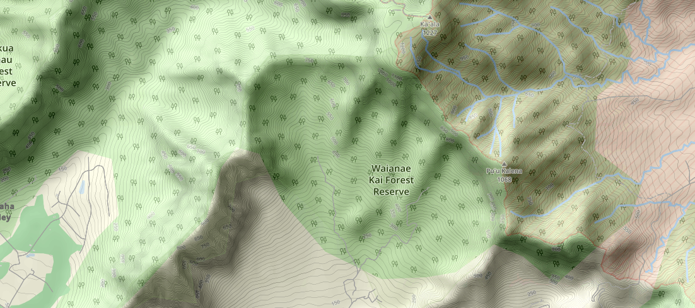

# Topographic CartoCSS style


A simple topographic, [OSM-Bright](https://github.com/mapbox/osm-bright) based CartoCSS style

## Why another CartoCSS style?
Just because I didn't find a topographic CartoCSS style.

## Install
The style uses the same shapefiles (`simplified_land_polygons.shp` and `land_polygons.shp` only) and tables layout as [opestreetmap-carto](https://github.com/gravitystorm/openstreetmap-carto) style, so refer to the [INSTALL guide](https://github.com/gravitystorm/openstreetmap-carto/blob/master/INSTALL.md) in order to get the shapefiles and populate the DB.

In addition, the style uses hillshades files and contours DB (contains contour data, in webmercator projection).

To create them, use [OpenTopoMap guide](https://github.com/der-stefan/OpenTopoMap/blob/master/mapnik/HOWTO_DEM.md) or see [below](#large-scale-contours-and-hillshade-datasets).

Be aware that the style uses also `contours_20` DB, which is a simplified version (with an error of 20M) of `contours` DB, for the lower levels. You can populate the simplified version by the grass gis `v.generalize` command, or by using the phyghtmap `simplifyContoursEpsilon` flag.


Build `mapnik.xml` using `build.py` script.

The parameters are: 
- `--input_file` (required): A path to `mapnik.xml` file.
- `--input_project_file` (optional): A path to project (mml) file. Supply this parameter if you want to edit this style with [Tilemill](https://github.com/tilemill-project/tilemill).
- `--db_name` (required): The OSM data DB name. The data in this DB should be loaded with osm2pgsql.
- `--user_name` (required): A username with write permission to the OSM and contours DBs.
- `--password` (required): A password for the username with write permission to the OSM and contours DBs.
- `--host` (required): The host of the DBs.
- `--external_layers_folder` (required): A path that contains the following hillshade raster files:
  - hillshade_30.tif - An hillshae raster with a resolution of 30 meters per pixel. The raster should be in webmercator projection (EPSG:3857).
  - hillshade_90.tif - An hillshae raster with a resolution of 90 meters per pixel. The raster should be in webmercator projection (EPSG:3857).
  - hillshade_700.tif - An hillshae raster with a resolution of 700 meters per pixel. The raster should be in webmercator projection (EPSG:3857).
  - hillshade_1000.tif - An hillshae raster with a resolution of 1000 meters per pixel. The raster should be in webmercator projection (EPSG:3857).
  - hillshade_5000.tif - An hillshae raster with a resolution of 5000 meters per pixel. The raster should be in webmercator projection (EPSG:3857).
- `--simplified_land_polygons` (required): A path to **simplified** land shapefile (see [openstreetmap-carto shapefiles](https://github.com/gravitystorm/openstreetmap-carto/blob/master/INSTALL.md#manual-download)).
- `--land_polygons` (required): A path to land shapefile (see [openstreetmap-carto shapefiles](https://github.com/gravitystorm/openstreetmap-carto/blob/master/INSTALL.md#manual-download)).
- `--language` (optional): The prefered language code in which the place labels should be rendered. Default: `en`.

## Serving Tiles
There are a lot of options to serve mapnik rendered tiles. For example, see [this guide](https://switch2osm.org/manually-building-a-tile-server-18-04-lts/).

## Large scale contours and hillshade datasets
Processing of world scale hillshades and contours datasets can take a lot of time (months) using [OpenTopoMap guide](https://github.com/der-stefan/OpenTopoMap/blob/master/mapnik/HOWTO_DEM.md).

If your map covers a large area, you can use the scripts in the `scripts` folder, which run contours processing and hillshading in parallel. It's recommended to use SSD HD if available to speed up the processing.

For example, processing hillshade for 1/4 of the world (30M per pixel) took only few hours with these scripts, instead of months with the original gdal commands.

**Note:** 
  The scripts create children processes in the background so stopping one of the scripts (`Ctrl+C`) won't terminate the processes.

### Preprocessing
In order to use the scripts, you should:
- Install gdal/ogr utilities (version >= 2.0).
- Install grass gis (version >= 7.2).
- Install osm2pgsql
- Install python 2.7
- Install GNU parallel
- To ensure that everything is installed properly, you can run the tests:

```bash
cd scripts/tests
./test.sh
```

- Download DEM data (you can use [phyghtmap](http://katze.tfiu.de/projects/phyghtmap/) for this). For example:
  
  ```bash
  phyghtmap --area=-162.754757:16.294779:-150.279273:23.748636 --download-only --srtm=1 --earthexplorer-user=EARTHEXPLORER_USERNAME --earthexplorer-password=EARTHEXPLORER_PASSWORD --hgtdir ./hawaii_data
  ```
  (Sign up for [earthexplorer](https://earthexplorer.usgs.gov/) before).
- Fill no data
  
  ```bash
  cd ./hawaii_data/SRTM1v3.0
  
  for tiffile in *.tif; do gdal_fillnodata.py $tiffile ${tiffile%%.tif}.filled.tif && rm $tiffile; done;
  ```
- Make vrt
  
  ```bash
  find . -iname '*.filled.tif' -exec echo {} >> ./file_list.txt \;
  gdalbuildvrt -srcnodata -32767 -vrtnodata -32767 -input_file_list ./file_list.txt ./unified_raster.vrt
  ```
- Warp the data (virtualy)
  
  ```bash
  gdalwarp -t_srs EPSG:3857 -of VRT -r cubicspline -tr 30 30 ./unified_raster.vrt ./unified_raster_30_3857.vrt
  gdalwarp -t_srs EPSG:3857 -of VRT -r cubicspline -tr 90 90 ./unified_raster.vrt ./unified_raster_90_3857.vrt
  gdalwarp -t_srs EPSG:3857 -of VRT -r bilinear -tr 700 700 ./unified_raster.vrt ./unified_raster_700_3857.vrt
  gdalwarp -t_srs EPSG:3857 -of VRT -r bilinear -tr 1000 1000 ./unified_raster.vrt ./unified_raster_1000_3857.vrt
  gdalwarp -t_srs EPSG:3857 -of VRT -r bilinear -tr 5000 5000 ./unified_raster.vrt ./unified_raster_5000_3857.vrt
  ```

### Hillshades
The following commands create hillshade rasters

```bash
cd scripts
./shade_all.sh /full/path/to/hawaii_data/SRTM1v3.0/unified_raster_30_3857.vrt /full/path/to/hawaii_data/hillshades/hillshade_30.tif 2 <Number of concurrent jobs>
# Clean temporary data if errors were reported
#rm -r -f /full/path/to/hawaii_data/hillshades/tmp

./shade_all.sh /full/path/to/hawaii_data/SRTM1v3.0/unified_raster_90_3857.vrt /full/path/to/hawaii_data/hillshades/hillshade_90.tif 2 <Number of concurrent jobs>
# Clean temporary data if errors were reported
#rm -r -f /full/path/to/hawaii_data/hillshades/tmp

./shade_all.sh /full/path/to/hawaii_data/SRTM1v3.0/unified_raster_700_3857.vrt /full/path/to/hawaii_data/hillshades/hillshade_700.tif 4 <Number of concurrent jobs>
# Clean temporary data if errors were reported
#rm -r -f /full/path/to/hawaii_data/hillshades/tmp

./shade_all.sh /full/path/to/hawaii_data/SRTM1v3.0/unified_raster_1000_3857.vrt /full/path/to/hawaii_data/hillshades/hillshade_1000.tif 7 <Number of concurrent jobs>
# Clean temporary data if errors were reported
#rm -r -f /full/path/to/hawaii_data/hillshades/tmp

./shade_all.sh /full/path/to/hawaii_data/SRTM1v3.0/unified_raster_5000_3857.vrt /full/path/to/hawaii_data/hillshades/hillshade_5000.tif 7 <Number of concurrent jobs>
# Clean temporary data if errors were reported
#rm -r -f /full/path/to/hawaii_data/hillshades/tmp
```

#### Build overviews
In the near future mapnik should properly handle gdal overviews, so it's a good idea to build overviews for large hillshade rasters.
This can take quite long time:
```bash
gdaladdo -ro --config TILED_OVERVIEW yes --config COMPRESS_OVERVIEW JPEG --config BIGTIFF_OVERVIEW YES --config INTERLEAVE_OVERVIEW PIXEL /full/path/to/hawaii_data/hillshades/hillshade_30.tif 2 4 8 16
```

### Contours
The following commands create contours shapefiles. They use parallel processing which:
- Divides the raster into virtual (VRT) tiles.
- Smoothes the raster (using grass r.neighbors command). Needed for smoothed output contours.
- Creates contours shapefiles.
- Creates simplified contours shapefiles.

```bash
cd scripts
./compute_contours.sh /full/path/to/hawaii_data/SRTM1v3.0/unified_raster_30_3857.vrt <output contours folder> <Number of concurrent jobs> /path/to/logs/folder/log.txt
```

Loading to DB:
```bash
# Create DB
sudo -u postgres createdb contours -O $USER
sudo -u postgres createdb contours_20 -O $USER
sudo -u postgres psql contours -c 'CREATE EXTENSION postgis;'
sudo -u postgres psql contours_20 -c 'CREATE EXTENSION postgis;'

# Load empty pbf, just for creating the tables, indexes, etc. You can find the PBF file in scripts/contours_empty.pbf
osm2pgsql --slim -d contours -U $USER -W --cache 5000 --style contours.style contours_empty.pbf
osm2pgsql --slim -d contours_20 -U $USER -W --cache 5000 --style contours.style contours_empty.pbf

# Load shapefiles to the db. The <contours folder> is the output folder you gave in the above ./compute_contours.sh command
./load_shapefiles_to_db.sh <contours folder> <postgres host> <postgres user> /path/to/logs/folder/log.txt
```
### Using Dockerfile
All of the above scripts can be run from a docker image that you can build from scripts/Dockerfile.

Grass gis commands (which are used in the scripts for contour processing) need to be ran by the user that is the owner of the output directory (running as root is not enough).

You can find your user id (which should be the owner of the output directory) by:
```bash
id -u $USER
```
Then replace the user id `1000` in the Dockerfile with your user id.

Build the docker image:
```bash
cd scripts
docker build -t compute_contours .
```

Run a script with:
```
docker run -u <YOUR USER ID> --rm -it -v /path/to/input/directory:/input -v /path/to/output/directory:/output -w /src compute_contours ./compute_contours.sh /input/mercator.vrt /output/output_contours 7 /output/output_contours/logs/log.txt
```
**Note:**
By default, the VRT files made in the 'Preprocessing' stage use relative path to the actual files. Make sure that the relative path is also available on the volume from within the container.

## Editing
- Install [Tilemill](https://github.com/tilemill-project/tilemill).
- Clone the project into tilemill project path (On linux: under `~/Documents/MapBox/project`).
- Build the project file (using `build.py` with `--input_project_file` parameter).
- Open tilemill and choose `JNet` project.
- Due to a bug in Tilemill, in order to see your changes, export the Mapnik XML into the project directory (use default name), after saving your changes.

## TODO:
Add additional layers
